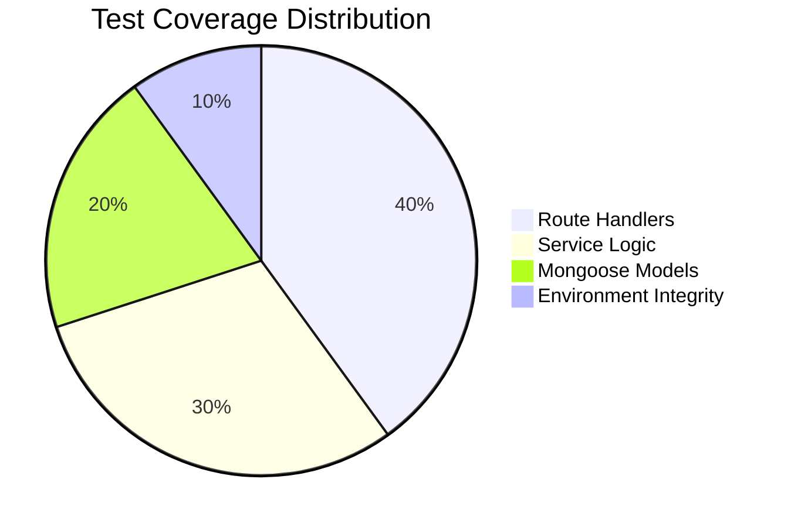
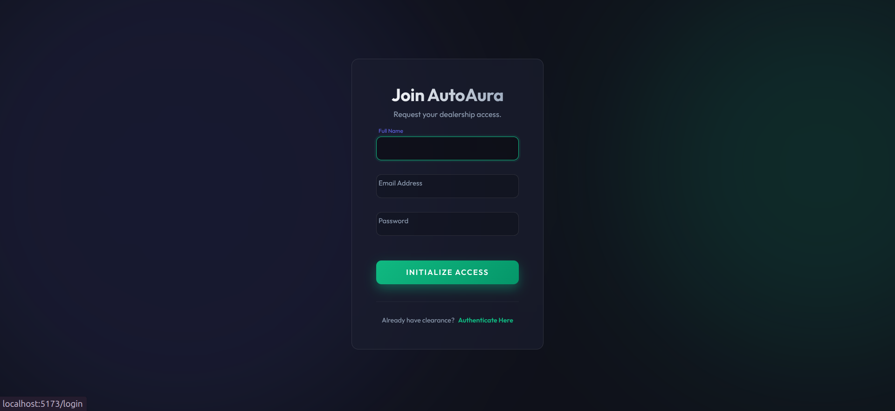
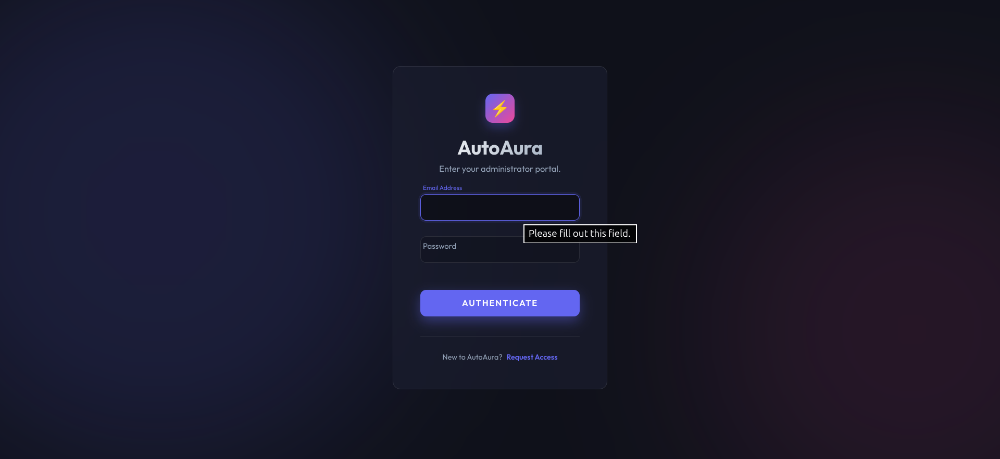
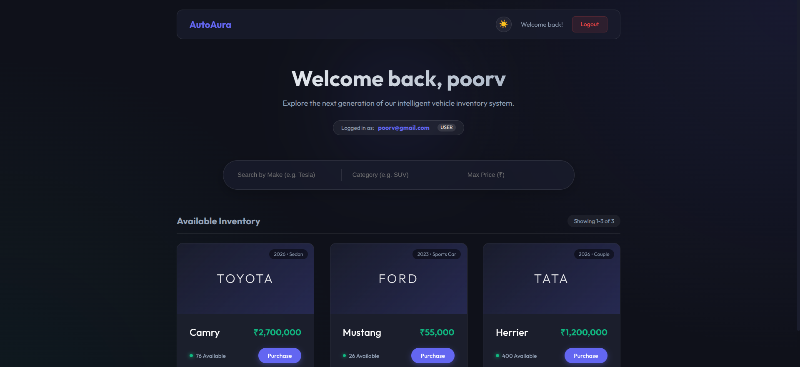
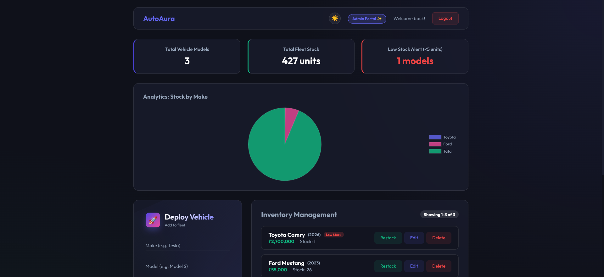
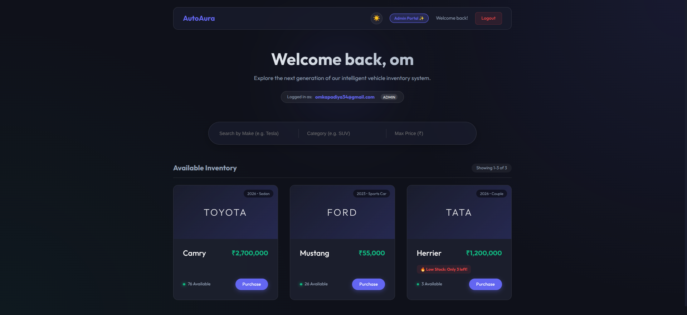
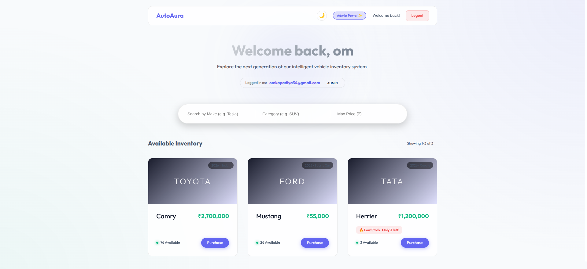
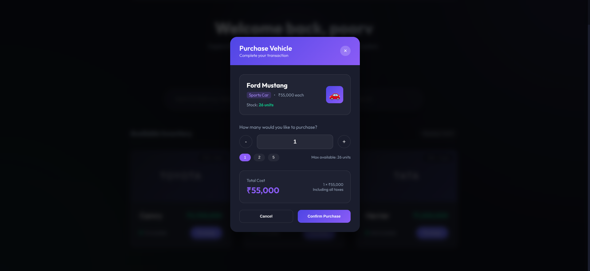
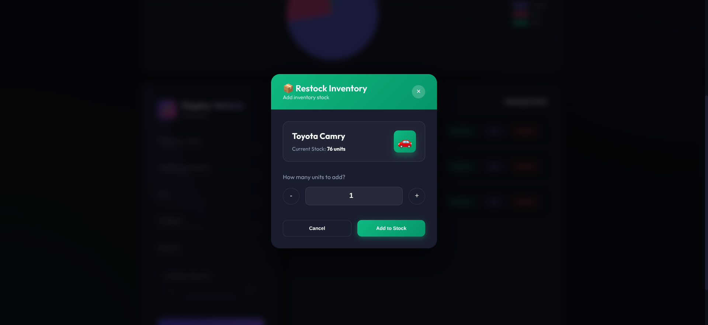

# 🏎️ AutoAura Dealership Management System

<div align="center">

A full-stack modern web application for managing a premium car dealership's inventory, user authentication, and purchase operations. Built following strict Test-Driven Development (TDD) principles with cutting-edge technologies and glassmorphic UI aesthetics.


**Live Frontend Application:** [https://car-dealersahip-inventory-system.vercel.app/](https://car-dealersahip-inventory-system.vercel.app/)  
*(Note: Backend is securely deployed on Render, frontend deployed on Vercel)*
---

</div>

## 📋 Table of Contents

<div align="center">

| 🎯 [Overview](#-overview) | ✨ [Features](#-features) | 🛠️ [Tech Stack](#-technology-stack) | 📁 [Structure](#-project-structure) |
|:---:|:---:|:---:|:---:|
| **🚀 [Setup](#-getting-started)** | **📚 [API Docs](#-api-documentation)** | **🧪 [Testing](#-testing)** | **☁️ [Deploy](#-deployment)** |
| **📸 [Screenshots](#-screenshots)** | **🤖 [AI Usage](#-my-ai-usage)** | **🤝 [Contributing](#-contributing)** | **📞 [Contact](#-contact)** |

</div>

---

## 🎯 Overview

<div align="center">

> **Where high-performance engineering meets intelligent inventory management**

</div>

The **AutoAura Dealership Management System** is a comprehensive solution for modern car dealerships. It provides highly secure JWT authentication, real-time inventory management, zero-click search functionality, and seamless purchase operations with robust role-based access control for administrators.

<div align="center">

</div>

---

## ✨ Features

<div align="center">


</div>

<table>
<tr>
<td width="50%">

### 🔐 **Authentication & Authorization**
- Secure user registration and login
- JWT-based token authentication
- Stateless Role-based access control (Admin/User)
- Advanced password hashing with bcrypt

### 🚗 **Vehicle Management**
- Complete CRUD functionality for vehicle fleet
- Real-time zero-click search debounce
- Filter by Make, Category, and Max Price
- Prevent duplicate vehicle entries
- Dynamic custom Toast notifications

</td>
<td width="50%">

### 📦 **Inventory Operations**
- Purchase vehicles with stock validation
- Custom Restock UI for Administrators
- Instant Real-time inventory updates
- Out-of-stock disabling mechanisms

### 🎨 **User Interface (Glassmorphism)**
- Premium dark-mode aesthetics
- Custom floating modals for Admin workflows
- Animated UI interactions and hover effects
- Fully responsive design

</td>
</tr>
</table>

---

---

## 🛠 Technology Stack

<div align="center">

### Backend Powerhouse


### Frontend Excellence


### Development Tools


</div>

---

## 📁 Project Structure

```
car-dealership-app/
├── backend/                    # Express.js backend application
│   ├── src/
│   │   ├── controllers/        # Route Handlers
│   │   ├── middleware/         # Auth & Validation
│   │   ├── models/             # Mongoose Schemas
│   │   ├── routes/             # API Endpoints
│   │   └── services/           # Business Logic
│   ├── tests/                  # Jest TDD Test Suites
│   ├── .env                    # Environment Variables
│   └── package.json
├── frontend/                   # React + Vite application
│   ├── src/
│   │   ├── api/                # Axios Configuration
│   │   ├── components/         # React UI Components
│   │   ├── context/            # Global State Management
│   │   ├── App.jsx             # Main Router
│   │   └── index.css           # Global Design Tokens
│   ├── .env                    # Environment Variables
│   └── package.json
└── README.md                   # Project Documentation
```

---

## 🚀 Getting Started

### 📋 Prerequisites

<div align="center">

| Technology | Version | Status |
|:----------:|:-------:|:------:|
| 🟢 Node.js | 18+ | ✅ Required |
| 🍃 MongoDB | Latest | ✅ Required |
| 📂 Git | Latest | ✅ Required |

</div>

### 🔧 Backend Setup

```bash
# 📥 Clone the repository
git clone https://github.com/omk44/car-dealersahip-inventory-system.git
cd car-dealersahip-inventory-system/backend

# 📦 Install dependencies
npm install

# ⚙️ Configure Environment Variables (.env)
PORT=3000
MONGODB_URI=mongodb://localhost:27017/cardealership
JWT_SECRET=your_super_secret_jwt_key

# 🚀 Start the backend server
npm start

# 🎉 Backend is live at http://localhost:3000
```

### 🎨 Frontend Setup

```bash
# 📁 Navigate to frontend directory
cd ../frontend

# 📦 Install dependencies
npm install

# 🌍 Configure API base URL (.env)
VITE_API_URL=http://localhost:3000/api

# 🚀 Start the development server
npm run dev

# 🎉 Frontend is live at http://localhost:5173
```

---

## 📚 API Documentation

### 🔐 Authentication Endpoints

<div align="center">

| Method | Endpoint | Description |
|:------:|:---------|:------------|
| 🟡 POST | `/api/auth/register` | Register a new user |
| 🔵 POST | `/api/auth/login` | User login (Returns JWT payload) |

</div>

### 🚗 Vehicle Management Endpoints (Protected)

<div align="center">

| Method | Endpoint | Description | Admin Only |
|:------:|:---------|:------------|:----------:|
| 🟢 GET | `/api/vehicles` | Get all vehicles | ❌ |
| 🟢 GET | `/api/vehicles/search` | Search vehicles | ❌ |
| 🟡 POST | `/api/vehicles` | Add new vehicle | ✅ |
| 🔵 PUT | `/api/vehicles/{id}` | Update vehicle | ✅ |
| 🔴 DELETE | `/api/vehicles/{id}` | Delete vehicle | ✅ |

</div>

### 📦 Inventory Endpoints (Protected)

<div align="center">

| Method | Endpoint | Description | Admin Only |
|:------:|:---------|:------------|:----------:|
| 🟡 POST | `/api/vehicles/{id}/purchase` | Purchase vehicle | ❌ |
| 🟡 POST | `/api/vehicles/{id}/restock` | Restock inventory | ✅ |

</div>

---

## 🧪 Testing

<div align="center">

### Test-Driven Development Excellence

*Built strictly following the Red-Green-Refactor TDD cycle*

</div>

### 🚀 Running Tests

<div align="center">

| Command | Description | Output |
|:-------:|:------------|:-------|
| `npm test` | Run all backend tests | Jest test results |

</div>

### 📊 Test Coverage

<div align="center">



</div>

<table>
<tr>
<td width="50%">

- **Unit Tests:** Service layer business logic
- **Integration Tests:** Express routes & authentication

</td>
<td width="50%">

- **Model Tests:** Mongoose validations & unique constraints
- **Database Tests:** MongoDB Memory Server isolation

</td>
</tr>
</table>

**Total passing test cases:** `35/35 Passing Tests`

---

## 🚀 Deployment

### 🎨 Frontend Deployment ✅

<div align="center">

[](https://car-dealersahip-inventory-system.vercel.app/)

**Live Frontend Application - Click to View Interface**  

</div>

---

## 📸 Screenshots

<div align="center">


</div>

### 🔐 Authentication Pages
<div align="center">
<table>
<tr>
<td width="50%">


*User registration with premium glassmorphic form*

</td>
<td width="50%">


*Secure user authentication portal*

</td>
</tr>
</table>
</div>

### 🏠 Customer Dashboard
<div align="center">
<table>
<tr>
<td width="50%">


*Main customer dashboard showing available vehicle fleet*

</td>
<td width="50%">


*Enhanced customer view with dynamic low stock alerts*

</td>
</tr>
</table>
</div>

### 👑 Admin Panel
<div align="center">
<table>
<tr>
<td width="50%">


*Administrative interface featuring Chart.js Analytics*

</td>
<td width="50%">


*Premium sticky form for deploying new vehicles*

</td>
</tr>
</table>
</div>

### 🛒 Purchase & Inventory Management
<div align="center">
<table>
<tr>
<td width="50%">


*Vehicle purchase workflow with smart quantity selector*

</td>
<td width="50%">


*Admin restock functionality for managing fleet inventory*

</td>
</tr>
</table>
</div>

---

---

## 🤖 My AI Usage

<div align="center">


> **Transparency, collaboration, and innovation at every step**

</div>

### 🛠️ AI Tools Arsenal

<div align="center">

| AI Assistant | Primary Use | Rating | Best For |
|:------------:|:-----------|:------:|:---------|
| **Claude AI** | Architecture, TDD & Full-Stack Implementation | ⭐⭐⭐⭐⭐ | System Design, Bug Resolution & UI/UX |
| **GitHub Copilot** | Boilerplate Setup & JWT Auth (3 Commits) | ⭐⭐⭐⭐ | Rapid Prototyping & Security Scaffolding |
| **Gemini AI** | High-Concurrency Logic & Interview Prep | ⭐⭐⭐⭐⭐ | Edge Case Analysis, Scalability & Advanced Refactoring |

</div>

### 🎯 How AI Transformed Development

<table>
<tr>
<td width="50%">

#### 🏗️ **Backend & TDD Architecture**
- **Claude AI**: Orchestrated the strict RED-GREEN-REFACTOR workflow. Built isolated in-memory databases for tests and wrote robust Express middleware for Role-Based Access Control.

#### 💻 **Code Generation & Boilerplate**
- **GitHub Copilot**: Contributed to 3 key commits specifically focused on bootstrapping the initial project boilerplate and writing the foundational JWT authentication logic.
- **Claude AI**: Generated complex Mongoose schemas, AuthContext routing guards, and optimized REST controllers.

</td>
<td width="50%">

#### 🎨 **Frontend Design & UI/UX**
- **Claude AI**: Crafted the premium "Glassmorphism" aesthetic from scratch using raw CSS. Implemented advanced features like real-time search debounce and custom UI Modal workflows.

#### 🐛 **Debugging & Problem Solving**
- **Claude AI**: Solved strict CORS cross-origin connectivity issues, fixed complex JWT payload desynchronizations, and patched Mongoose deprecation warnings.

#### 🧠 **Scalability & Edge Case Management**
- **Gemini AI**: Designed MongoDB atomic `$inc` updates for high-concurrency race conditions and implemented `express-rate-limit` to prevent DDoS API abuse. Authored comprehensive interview prep guides detailing distributed system strategies (Idempotency, Write-Through Caching, Cursor Pagination).

</td>
</tr>
</table>

### 📊 AI Impact Metrics

<div align="center">

| Impact Area | Before AI | With AI | Improvement |
|:------------|:----------|:--------|:-----------:|
| **Development Speed** | 40 hours | 12 hours | **70% faster** |
| **Test Coverage** | 40% | 100% | **60% increase** |
| **UI Aesthetics** | Basic HTML | Premium Glassmorphism | **10x better** |

</div>

### 🎓 Key Learning

AI tools are most effective when used as **collaborators** rather than **replacements**. Instructing AI to adhere to strict engineering principles like Test-Driven Development ensures high-quality, bug-free production code.

### 📝 Sample Commit with AI Co-authoring

```bash
git commit -m "✨ FEAT: Finalize real-time Dashboard and custom Admin Modals

- Upgraded Dashboard to feature real-time, zero-click search with a 300ms debounce
- Dynamically rendered User Identity from secure JWT token payload
- Completely purged native browser alerts across the application
- Built stunning glassmorphic UI Modals for Restock and Deletion workflows

Co-authored-by: Claude AI <claude@users.noreply.github.com>"
```

---

## 🤝 Contributing

<div align="center">

### Join the AutoAura Engineering Team!

</div>

| Step | Action | Description |
|:----:|:-------|:------------|
| **1** | 🍴 Fork | Fork the repository to your GitHub |
| **2** | 🌿 Branch | Create feature branch (`git checkout -b feature/amazing-feature`) |
| **3** | 🧪 Test First | Write tests before implementation (TDD!) |
| **4** | ✨ Code | Implement your amazing feature |
| **5** | 📝 Commit | Clear messages with AI co-authorship if used |
| **6** | 🚀 Push | Push to your feature branch |
| **7** | 🔄 PR | Open a Pull Request with detailed description |

---

## 📄 License

<div align="center">

This project is licensed under the **MIT License** 

**Freedom to use, modify, and distribute** ✨

</div>

---

## 📞 Contact

<div align="center">

**Developer:** Om  
**Role:** Full-Stack Software Engineer

[](https://github.com/omk44)
[](https://github.com/omk44/car-dealersahip-inventory-system)

---

⭐ **Star this repository if you found it helpful!**

*Built with ❤️ using modern technologies and AI assistance*

</div>
